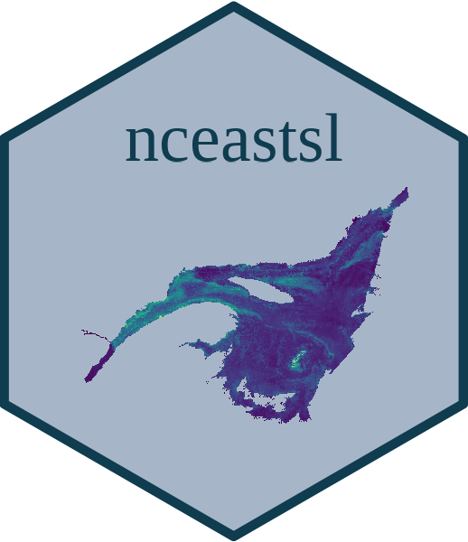

# :book: Interactions amplify cumulative effects in marine food webs 

This is the research compendium for the cumulative effects of glob al changes on the communities of the St. Lawrence. 

It includes the code that we used for the manuscript: "Interactions amplify cumulative effects in marine food webs".

- Publication: [DOI: ](link)
- Preprint: [DOI: ](link)
- Data: [DOI: ](link)
- Code: [DOI: 10.5281/zenodo.8222068](https://doi.org/10.5281/zenodo.8222068)

